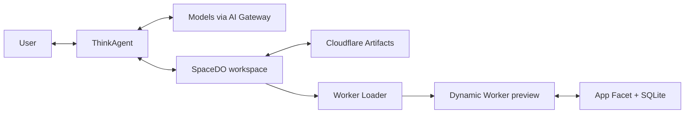

# Cloudflare VibeSDK

> An open source, agentic platform for building and deploying full-stack applications on Cloudflare.

<div align="center">

**[Try VibeSDK at build.cloudflare.dev](https://build.cloudflare.dev)**

[](https://deploy.workers.cloudflare.com/?url=https://github.com/cloudflare/vibesdk)

</div>

## What is VibeSDK?

VibeSDK lets people build full-stack applications by working with an AI coding agent. Describe what you want, answer clarifying questions, and follow the agent as it plans, edits files, deploys previews, inspects errors, and iterates with you in the loop.

The platform runs the complete workflow on Cloudflare. Think drives the agentic model-and-tool loop, a Durable Object provides an isolated workspace for each project, Dynamic Workers serve generated application previews, Durable Object Facets provide per-app SQLite storage, and Cloudflare Artifacts stores durable git history and restore points.

## Capabilities

- **Agentic code generation**: Build iteratively through a model-and-tool loop instead of a fixed sequence of generation phases.
- **Human-in-the-loop clarification**: Let the agent ask structured questions when a request is underspecified.
- **Live workspace**: Follow generated files and edits in an integrated code editor.
- **Dynamic previews**: Bundle generated code and load each preview as a Dynamic Worker without a long-running development server.
- **Browser verification**: Inspect browser console output, repair runtime errors, and redeploy in the same loop.
- **Application data**: Give each generated app isolated SQLite-backed storage through a Durable Object Facet, with database inspection and reset controls.
- **Version history**: Save agent-created restore points in Cloudflare Artifacts and roll back without rewriting existing history.
- **Model flexibility**: Route configured model providers through AI Gateway with centralized observability and caching.
- **Realtime progress**: Stream agent output, tool activity, file changes, and deployment status to the UI.
- **Project export**: Export generated projects when you want to continue development outside VibeSDK.

## Architecture

| Component | Role |
|---|---|
| `ThinkAgent` | Agent powered by Cloudflare Think and backed by a Durable Object that runs the model-and-tool loop |
| `SpaceDO` | Durable Object that provides each project's isolated workspace and files |
| Cloudflare Artifacts | Binding that stores commits, branches, history, and restore points |
| Worker Loader | Binding that loads bundled code as a Dynamic Worker preview |
| Generated `App` | Durable Object Facet with isolated SQLite storage |
| AI Gateway | Routes configured model providers with observability and caching |



### Agent and tools

Think manages conversation history, streaming, skills, and the iterative model-and-tool loop. Its explicit tools read and edit the SpaceDO workspace, create restore points, deploy previews, inspect browser logs, and ask clarifying questions. Bash access is disabled.

### Previews and application data

VibeSDK bundles each committed deployment with `@cloudflare/worker-bundler` and loads it through the Worker Loader binding. Static assets are served by SpaceDO, while backend requests and WebSockets are forwarded to the generated `App` Durable Object Facet. Each Facet has isolated SQLite storage that users can inspect and reset.

### Files and version history

SpaceDO is the workspace and file layer. Cloudflare Artifacts is the git and version-history layer. Rollback restores a selected commit into the current branch, creates a new commit, and redeploys without rewriting history.

## Agent workflow

1. **Understand**: Read the request and ask structured questions when important details are missing.
2. **Build**: Create and edit files in the SpaceDO workspace.
3. **Save**: Record coherent restore points in Cloudflare Artifacts.
4. **Deploy**: Commit and bundle the current branch into a Dynamic Worker preview.
5. **Verify**: Inspect the live preview and browser console output.
6. **Repair**: Fix build or runtime errors and repeat the deploy-and-verify loop.
7. **Stream**: Continuously surface output, tool calls, files, and preview status in the UI.

## Deploy your own VibeSDK

The fastest way to deploy is the Deploy to Cloudflare flow:

[](https://deploy.workers.cloudflare.com/?url=https://github.com/cloudflare/vibesdk)

You will need:

- A Cloudflare account with the required Workers features enabled.
- A Workers Paid plan and Workers for Platforms access for production app previews.
- A Cloudflare API token with access to the resources created by setup.
- Credentials for at least one supported model provider, unless you use provider keys stored in AI Gateway.
- A custom domain for production, including wildcard DNS and Advanced Certificate Manager when required by your subdomain layout.

Authentication providers, model providers, and export integrations are optional and configuration-dependent. See the [complete setup guide](docs/setup.md) for current permissions, DNS, AI Gateway, provider, OAuth, and production configuration.

## Local development

### Prerequisites

- Node.js 18 or later
- [Bun](https://bun.sh/)
- A Cloudflare account and API token

### Quick start

```bash
git clone https://github.com/cloudflare/vibesdk.git
cd vibesdk
bun install
bun run setup
bun run dev
```

Open `http://localhost:5173`. The setup script configures local and production environments, Cloudflare resources, AI Gateway and model providers, authentication, and database migrations.

For all setup options and troubleshooting, read [`docs/setup.md`](docs/setup.md).

### Feature toggles

Feature settings are dashboard-managed rather than committed in `wrangler.jsonc`, so production values survive deploys through `keep_vars: true`. Set them in the Cloudflare dashboard for each deployed environment, or in `.dev.vars` for local development. Unset values default to off unless noted otherwise: `ENABLE_ARTIFACTS`, `ENABLE_READ_REPLICAS`, `ENABLE_CLOUDFLARE_LIMITS`, `ENABLE_USER_ACCOUNT_DEPLOY`, `ALLOWED_EMAIL`, `USE_CLOUDFLARE_IMAGES`, and `USE_TUNNEL_FOR_PREVIEW`; `ENABLE_EMAIL_AUTH` defaults to on. `ALLOCATION_STRATEGY` uses its normal default when unset. See the [feature-toggle setup reference](docs/setup.md#dashboard-managed-feature-toggles) for dependencies and behavior.

### Development commands

| Command | Purpose |
|---|---|
| `bun run dev` | Start the frontend development server |
| `bun run dev:browser` | Start the optional local browser sidecar used for console-log inspection |
| `bun run build` | Build SpaceDO and the Vite application |
| `bun run typecheck` | Run TypeScript type checking |
| `bun run lint` | Run ESLint |
| `bun run test` | Run the test suite |
| `bun run test:watch` | Run tests in watch mode |
| `bun run deploy` | Build, migrate, and deploy using `.prod.vars` |

## Security and isolation

- **Project isolation**: Each app maps to its own ThinkAgent Durable Object, SpaceDO workspace, Artifacts repository, and generated application Facet.
- **Tool boundaries**: Think uses explicit workspace and product tools; workspace bash access is disabled.
- **Application data isolation**: Each generated application stores its data in its own SQLite-backed Durable Object Facet.
- **Preview authorization**: Preview URLs use signed, branch-scoped access.
- **Secret handling**: Provider and platform credentials flow through configured Cloudflare services and bindings.
- **Reversible changes**: Artifacts-backed restore points make deployed changes recoverable without deleting history.

## Troubleshooting

- **Preview does not resolve**: Confirm the wildcard DNS record is proxied, allow time for DNS propagation, and verify any required Advanced Certificate Manager configuration.
- **AI Gateway authentication fails**: Confirm the gateway and token are configured, the token has Run permission, and the selected provider has valid credentials or stored keys.
- **Database migrations fail**: Check D1 access and API-token permissions, then retry after newly provisioned resources become available.
- **Required variables are missing**: Verify `JWT_SECRET`, Cloudflare account credentials, AI Gateway settings, and credentials for every enabled provider or integration.

More diagnostics are available in the [setup guide](docs/setup.md). For help, use [GitHub issues](https://github.com/cloudflare/vibesdk/issues), [GitHub discussions](https://github.com/cloudflare/vibesdk/discussions), or the [Cloudflare Developers Discord](https://discord.gg/cloudflaredev).

## Contributing

1. Fork and clone the repository.
2. Run `bun install` and `bun run setup`.
3. Make focused changes that follow [`AGENTS.md`](AGENTS.md).
4. Run `bun run typecheck`, `bun run lint`, and `bun run test`.
5. Open a pull request describing the change and how you validated it.

## Resources

- [VibeSDK demo](https://build.cloudflare.dev)
- [VibeSDK setup guide](docs/setup.md)
- [Cloudflare Workers](https://developers.cloudflare.com/workers/)
- [Cloudflare Agents](https://developers.cloudflare.com/agents/)
- [Durable Objects](https://developers.cloudflare.com/durable-objects/)
- [AI Gateway](https://developers.cloudflare.com/ai-gateway/)
- [Cloudflare Developer Platform Discord](https://discord.gg/cloudflaredev)
- [Cloudflare Community](https://community.cloudflare.com/)

## License

VibeSDK is available under the [MIT License](LICENSE).
